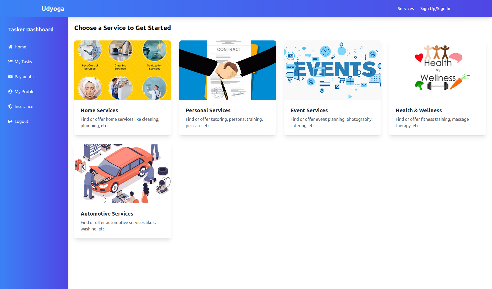
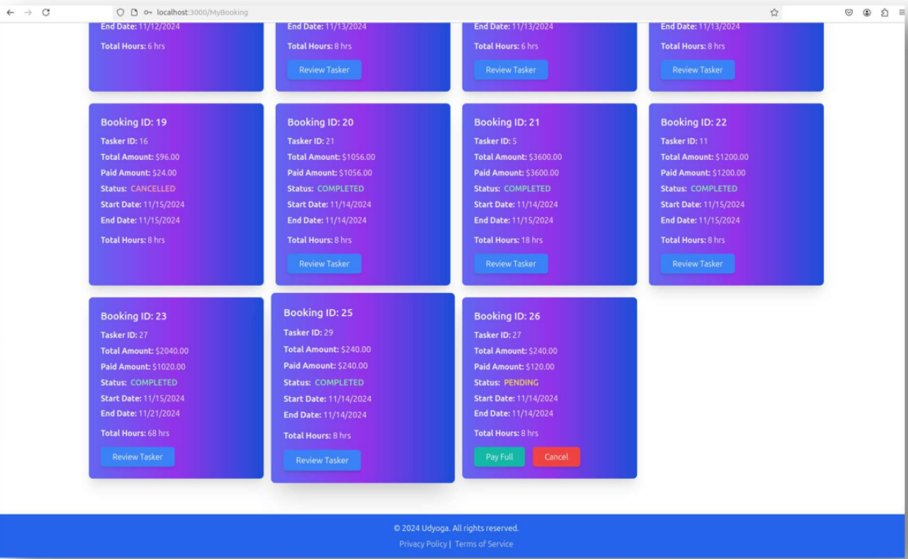
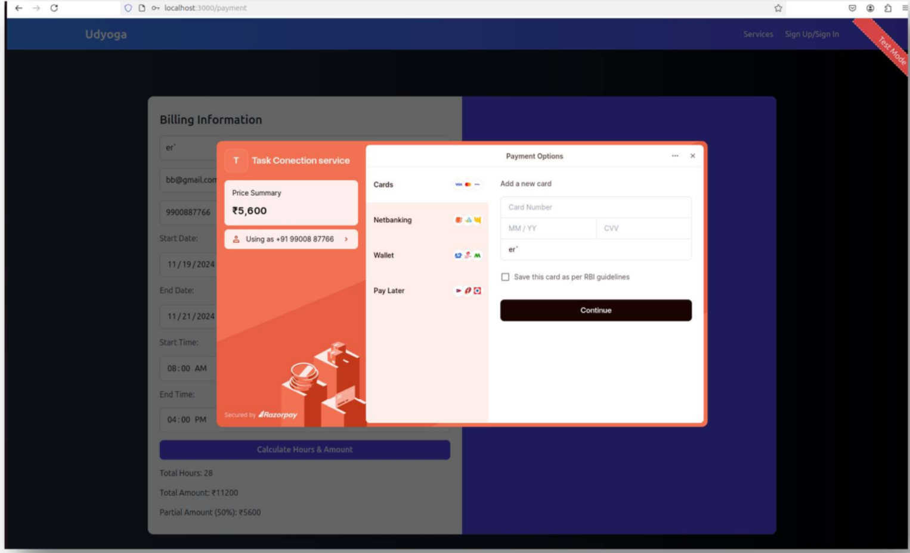

## Overview

This project is a platform designed to create employment opportunities by connecting skilled workers with employers. It enables users to easily search for and hire services for tasks like plumbing, cleaning, gardening, painting, and other fieldwork. Workers are paid on an hourly basis, providing flexibility and transparency. The platform includes a secure payment interface powered by Razorpay, ensuring seamless and safe transactions. With its user-friendly design, worker profiles, task reviews, and intelligent matching system, it offers an efficient solution for task-based employment.


**Access the application**:  
  Live demo:[https://task-connection-service-application.vercel.app/](https://task-connection-service-application.vercel.app/) 

### Visuals

Below are some images from the frontend directory showcasing the application interface:

1. **Homepage**  
   

2. **Task Listing**  
   

3. **Bookings**  
   

4. **Payment Interface**  
   

>

### Frontend
The **frontend** is built using [mention framework/library, e.g., React], providing a seamless and intuitive interface for users to find or post tasks.

### Backend
The **backend** is developed using [mention backend framework, e.g., Node.js, Spring Boot], managing authentication, task listings, and worker/employer connections. 

---

## Features

1. **Task Listings**: Employers can post tasks with details such as description, budget, and deadline.
2. **Worker Profiles**: Workers can create detailed profiles showcasing their skills and experience.
3. **Task Matching**: Intelligent matching algorithm to connect employers with suitable workers.
4. **Ratings and Reviews**: Employers and workers can review each other post-task completion.
5. **Secure Payments**: Integrated payment system for seamless transactions.

---

## Installation and Setup

### Prerequisites
- Node.js [version]
- SQL Database (e.g., MySQL or PostgreSQL)
- Razorpay account for payment integration


### Steps
1. Clone the repository:
   ```bash
   git clone  https://github.com/Imbasava/Task-connection-service-application.git


2. **Install dependencies for both frontend and backend**:

   - **Frontend**:
     ```bash
     cd frontend
     npm install
     ```

   - **Backend**:
     ```bash
     cd backend
     npm install
     ```

3. **Start the project**:

   - **Frontend**:
     ```bash
     cd frontend
     npm start
     ```

   - **Backend**:
     ```bash
     cd backend
     node server.js
     ```

4. **Access the application**:  
  Open your browser and navigate to [http://3.92.60.64:3000](http://3.92.60.64:3000) (default port for the frontend).


---

## Usage

- **For Employers**:
  1. Register an account and log in.
  2. Post tasks with relevant details.
  3. Browse worker profiles and assign tasks.

- **For Workers**:
  1. Create a profile showcasing your skills.
  2. Browse available tasks and apply for suitable ones.
  3. Manage assigned tasks and communicate with employers.

---

## Technologies Used

### Frontend
- React
- Tailwind CSS
- Razropay interface

### Backend
- Node.js with Express
- Mysql/PostgreSQL (or your chosen database)


---

## Contributing

Contributions are welcome!  

1. Fork the repository.
2. Create a new branch:  
  
3. Commit your changes:  
   
4. Push to the branch:  
  
5. Open a pull request.

---

## License

## License

This project is licensed under the **Custom Open License (COL) 1.0**.  
You are free to use, modify, and distribute the code with proper attribution.  

See the [LICENSE](./license.txt) file for the complete terms and conditions.
```

You can replace placeholders like `[version]` and `[Other tools/libraries]` with the actual details from your project. Let me know if further customization is needed!
